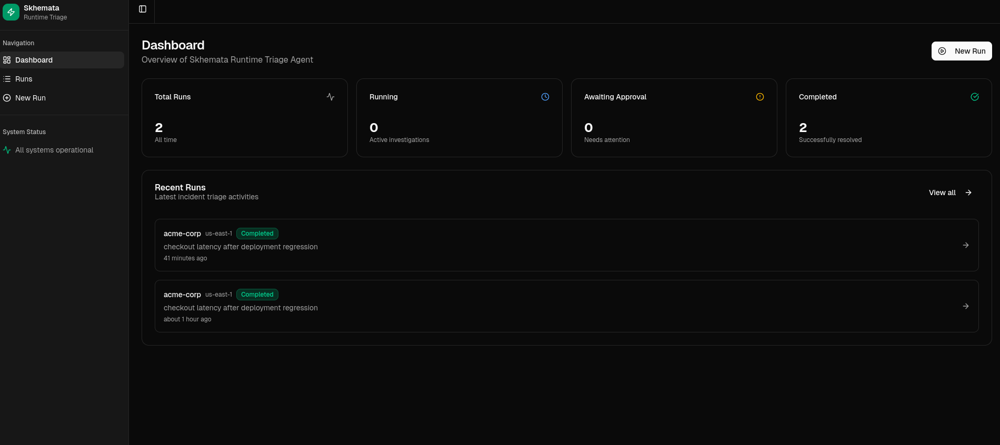
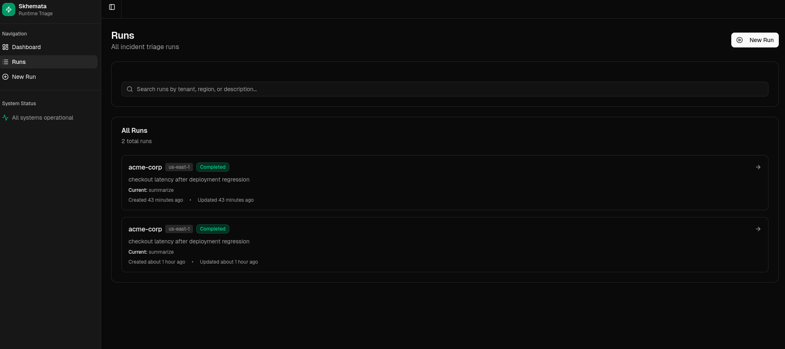
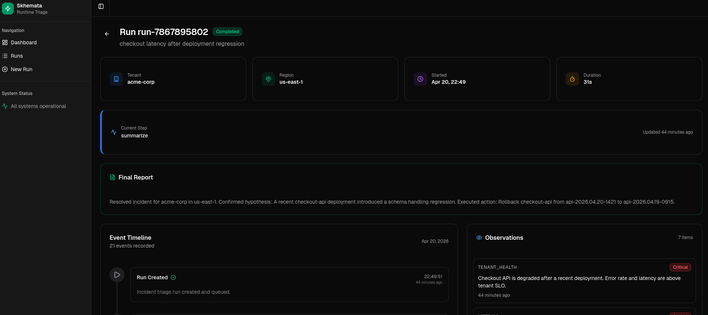

# Skhemata Runtime Triage Agent

Skhemata Runtime Triage Agent is a local-first engineering assessment project for runtime incident triage. It pairs an existing generated Next.js dashboard with a FastAPI backend, SQLite persistence, deterministic mock tools, and a graph-style Python agent runtime.

The system is intentionally self-contained: no paid API keys, no cloud accounts, no external infrastructure, and no authentication layer. All runtime operations are mocked so the assessment can focus on product behavior, backend design, state management, and operator approval flow.

## Demo Placeholders

More screenshots and gifs can be dropped into `docs/assets/`







## What Works

- Create tenant incident triage runs from the frontend.
- Persist runs, events, observations, hypotheses, tool outputs, proposed actions, checkpoints, errors, and final summaries in SQLite.
- Execute a deterministic state-machine runtime across the required steps:
  `intake`, `plan`, `inspect_metrics`, `inspect_logs`, `inspect_deployments`, `inspect_worker_health`, `update_hypothesis`, `decide_action`, `approval_gate`, `execute_action`, `verify`, `summarize`.
- Pause before risky remediation and require operator approve/reject.
- Resume after approval and complete verification plus final report.
- Select remediation based on mock scenarios:
  deployment regression, unhealthy worker, overloaded model pool.
- Reuse the existing frontend layout and styling with targeted API wiring only.

## How It Works

The frontend in `frontend/` is a Next.js operator dashboard. It calls the backend through `frontend/lib/api.ts` and reuses the existing run list, run detail, timeline, observations, hypotheses, tool output, and approval components.

The backend in `backend/app/` is a FastAPI service. `main.py` exposes the API routes, `db.py` persists runs and timeline events to SQLite, `runtime.py` advances the agent through explicit state-machine steps, and `tools.py` executes deterministic mock tools backed by `fixtures/scenarios.json`.

An end-to-end run looks like this:

1. The operator creates a run with tenant, region, and incident goal.
2. The backend stores the run and starts the state-machine runtime.
3. The runtime selects a mock scenario, gathers metrics/logs/deployments/worker health, records evidence, and updates hypotheses.
4. The runtime proposes a risky remediation and pauses at the approval gate.
5. The operator approves or rejects from the frontend.
6. If approved, the runtime executes the mocked remediation, verifies recovery, and writes a final summary.
7. If rejected, the decision is persisted and the remediation is not executed.

## Repository Layout

```text
backend/
  app/
    fixtures/scenarios.json   Mock incident scenarios and expected remediations
    db.py                     SQLite persistence helpers
    main.py                   FastAPI routes
    runtime.py                Agent state machine
    schemas.py                API response/request models
    tools.py                  Mock local runtime tools
  tests/
    test_api_runtime.py       Backend API/runtime tests
  requirements.txt

frontend/
  app/                        Existing Next.js dashboard routes
  components/                 Existing UI components and panels
  lib/api.ts                  Backend API client
  lib/types.ts                Shared frontend run types
  package.json

docs/
  architecture.md
  ai-log/README.md
```

For a deeper technical overview, see `docs/architecture.md`. It covers the agent runtime design, mock tool integration, SQLite state management, API layer, scenario selection, and key implementation tradeoffs.

For the AI interaction records, see `docs/ai-log/README.md` and `docs/ai-log/full-chat-transcript.md`.

## Backend Setup

From the repository root:

```bash
cd backend
python -m venv .venv
. .venv/bin/activate
pip install -r requirements.txt
python -m uvicorn app.main:app --host 127.0.0.1 --port 8000
```

The backend serves:

- API base URL: `http://127.0.0.1:8000`
- OpenAPI docs: `http://127.0.0.1:8000/docs`

SQLite data is stored at `backend/runtime.sqlite3`. The file is ignored by git.

## Frontend Setup

In a second terminal:

```bash
cd frontend
pnpm install --frozen-lockfile
pnpm dev
```

Then open `http://localhost:3000`.

If port `3000` is already in use:

```bash
pnpm exec next dev --webpack -p 3001
```

The frontend defaults to `http://localhost:8000` for the API. To override:

```bash
NEXT_PUBLIC_API_BASE_URL=http://127.0.0.1:8000 pnpm dev
```

On platforms where Next/Turbopack native bindings are unavailable, use Webpack:

```bash
pnpm exec next dev --webpack -p 3000
pnpm exec next build --webpack
```

## Using The Frontend

After the backend and frontend are running, open the frontend in your browser and use the existing dashboard UI:

```text
http://localhost:3000
```

If you started the frontend on another port, use that port instead, for example:

```text
http://localhost:3001
```

To create a run:

1. Click `New Run`.
2. Enter a tenant, region, and problem description.
3. Submit the form.
4. Open the run detail page.
5. Watch the timeline, observations, hypotheses, and tool outputs update.
6. When the approval panel appears, approve or reject the proposed action.
7. Review the final report after the run completes.

Example frontend inputs:

```text
Tenant: acme-corp
Region: us-east-1
Problem Description: checkout latency after deployment regression
```

This selects the deployment regression scenario and proposes a mocked deployment rollback.

```text
Tenant: fintech-plus
Region: us-west-2
Problem Description: analytics worker is stuck and queue depth is rising
```

This selects the unhealthy worker scenario and proposes a mocked worker restart.

```text
Tenant: modelco
Region: us-east-1
Problem Description: model pool overloaded and inference requests timing out
```

This selects the overloaded model pool scenario and proposes a mocked route failover.

## Tests And Checks

Backend tests:

```bash
cd backend
pytest
```

Frontend checks:

```bash
cd frontend
pnpm check
pnpm exec next build --webpack
```

The generated frontend did not include an ESLint dependency or config. The broken `lint` script was removed and replaced with `typecheck`/`check` scripts using TypeScript.

## API Summary

- `POST /api/runs`
- `GET /api/runs`
- `GET /api/runs/{id}`
- `GET /api/runs/{id}/events`
- `POST /api/runs/{id}/approve`
- `POST /api/runs/{id}/reject`
- `POST /api/runs/{id}/resume`
- `POST /api/runs/{id}/cancel`

Example create-run request:

```bash
curl -X POST http://127.0.0.1:8000/api/runs \
  -H 'Content-Type: application/json' \
  -d '{
    "tenant": "acme-corp",
    "region": "us-east-1",
    "goal": "checkout latency after deployment regression"
  }'
```

## Mock Scenarios

The runtime selects a scenario from the incident goal text:

- Deployment regression -> proposes `rollback_deployment`
- Unhealthy worker -> proposes `restart_worker`
- Overloaded model pool -> proposes `failover_route`

Fixture data lives in `backend/app/fixtures/scenarios.json`.

## Why No LangGraph Or LangChain

This project intentionally does not use LangGraph or LangChain. The assessment requirements called for a Python state-machine or graph-style runtime, local-first execution, deterministic mock infrastructure, persisted checkpoints, and an explicit operator approval flow. A small purpose-built runtime made those behaviors easier to inspect and test.

Avoiding LangGraph/LangChain also keeps the dependency surface small and removes ambiguity about where state transitions, resumability, tool calls, and approval gates are implemented. In this repo, those mechanics are visible directly in `backend/app/runtime.py`, with persistence in `backend/app/db.py` and deterministic tools in `backend/app/tools.py`.

For a production system with more complex branching, retries, tool orchestration, or model-backed planning, LangGraph could be a reasonable next step. For this assessment, a direct implementation is easier to review and better aligned with the no-cloud, no-paid-API constraint.

## What to Build Next

- Server-sent events or WebSocket updates instead of frontend polling.
- A richer run replay view using persisted checkpoints.
- More scenario fixtures and regression tests around ambiguous incidents.
- A small admin reset command for clearing local SQLite state during demos.
- Structured error recovery for interrupted background execution.

## Notes

- No authentication is included by design.
- No real runtime systems are contacted.
- No cloud integrations are required.
- The current frontend structure and styling were preserved.
